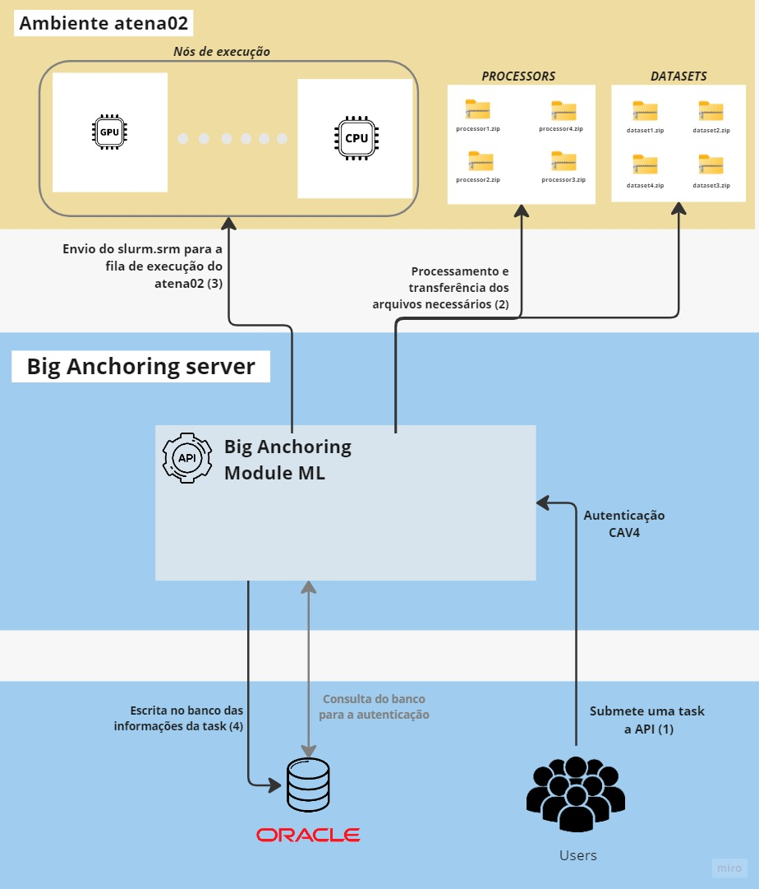

Exemplos de Uso
===============

Estes exemplos ilustram as principais funcionalidades dessa biblioteca em desenvolvimento. 
O objetivo dessa biblioteca é simplificar o acesso aos serviços de submissão de tarefas em diferentes infraestruturas,
oferecidas pela API do Big Anchoring Machine Learning Module. A figura abaixo ilustra de maneira simplificada como o 
serviço está atuando em relação à infraestrutura do atena02.

.. raw:: html

     

Nos exemplos a seguir, vemos inicialmente como fazer a submissão de uma tarefa para dentro do cluster e, na sequência,
como realizar a consulta do status da tarefa submetida.

Submissão de uma task ao atena02
-----------------------------

.. code-block:: python

   from biganchoring_ml_module import Submiter
   import json
   
   sb = Submiter(  runner_location="atena02", execution_mode="mlflow",
                experiment_name="test_lib", project_path="/path/to/MLflow_project",
                script_path="/path/to/script.py", instance_type="gpu",
                account="ICA_Team", dataset_name="/path/to/dataset.csv",
                n_estimators=2, random_state=42)

   submission_response = sb.submit_task()
   response_data = json.loads(submission_response.text)

   if response_data:
      job_id = response_data[0].get("job_id")
      task_id = response_data[0].get("id")
      experiment_name = response_data[0].get("experiment_name")
      instance_type = response_data[0].get("instance_type")

      print(f"Job ID: {job_id}")
      print(f"ID: {task_id}")
      print(f"experiment_name: {experiment_name}")
      print(f"instance_type: {instance_type}")

Obtendo informações de um JOB
-------------------------------------

.. code-block:: python

   from biganchoring_ml_module import TaskHandler
   import json

   task =  TaskHandler(job_id)
   status_data = task.get_job_information()
   status_data = json.loads(status_response.text)
   print(status_data)
