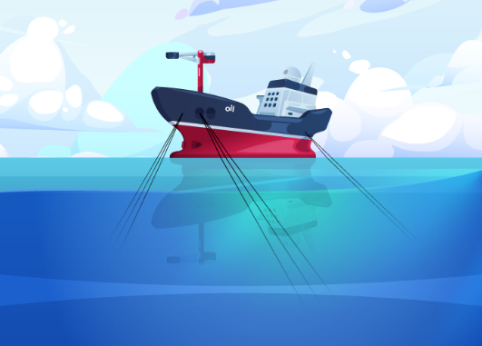
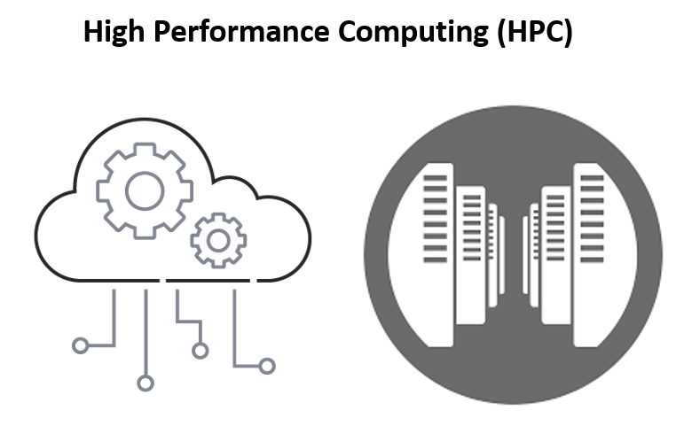
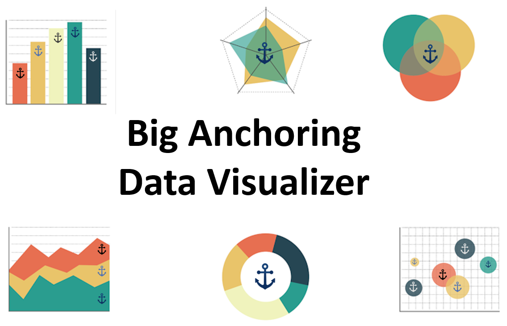

O projeto Big Anchoring
===============

   
.. raw:: html

     

O Big Anchoring é um projeto inovador, projetado para revolucionar o processo de ancoragem de FPSOs (Floating Production Storage and Offloading)
em múltiplos aspectos essenciais. O projeto se destaca por sua contribuição no gerenciamento e tratamento eficiente dos dados obtidos através do
sensoriamento das plataformas, garantindo que as informações críticas sejam processadas com precisão e rapidez.

Além disso, o Big Anchoring permite a flexibilidade de utilizar diferentes infraestruturas, sejam elas em nuvem (cloud) ou locais (on-premises),
para otimizar o processamento de tarefas, oferecendo soluções adaptáveis às necessidades específicas de cada operação. Outro ponto forte do projeto
é sua interface gráfica, que combina robustez com uma usabilidade intuitiva. Essa interface simplifica a visualização e o monitoramento dos dados disponíveis,
proporcionando uma experiência de usuário mais fluida, clara e eficiente.

Para atuar de forma eficiente nos diferentes aspectos do processo de ancoragem de FPSOs, o projeto Big Anchoring é dividido em três módulos principais:
**Gerenciamento de Dados**, **Processamento** e **Visualização**. Esses módulos trabalham em conjunto para garantir o tratamento adequado dos dados, a otimização do
processamento em diferentes infraestruturas (cloud e on-premises), e a visualização intuitiva das informações disponíveis.

.. raw:: html

     

Módulo de Gerenciamento de Dados Críticos
---------------------------------------------

Esse módulo apresenta uma plataforma Big Data e sistemas distribuídos, otimizada para o eficiente tratamento
de grandes volumes de dados em sistemas críticos, como a ancoragem de FPSOs,
utilizando datalakes e ecossistema Kafka.

**Eficiência no Gerenciamento de Dados Críticos**

Esse módulo do Big Anchoring é uma inovadora plataforma baseada em Big Data e sistemas distribuídos, 
dedicada ao gerenciamento eficiente de grandes volumes de dados em sistemas críticos, como a ancoragem de FPSOs.
Com uma arquitetura escalável de sistemas distribuídos, destaca-se por sua capacidade de criar datalakes organizados
para armazenamento e manipulação de dados estruturados e não-estruturados. Essa solução é essencial para o controle
eficaz de informações vitais em ambientes de produção de óleo e gás offshore.

Big Anchoring Machine learning Module
--------------------------------------------------

Com o aumento da complexidade dos modelos de inteligência artificial para o monitoramento de FPSOs e o consequente crescimento do volume de dados processados,
a necessidade de um aumento significativo na capacidade computacional torna-se evidente. Esse incremento é crucial para garantir a execução eficiente das tarefas,
o que torna indispensável o uso de infraestruturas de High-Performance Computing (HPC). Essas infraestruturas podem ser implementadas como clusters on-premises ou
por meio de recursos em nuvem (cloud), oferecendo a flexibilidade e escalabilidade necessárias para atender às demandas do projeto.

.. raw:: html

     

O módulo **Big Anchoring Machine Learning** oferece um serviço que facilita a utilização de diferentes infraestruturas, sejam elas clusters on-premises ou estruturas em nuvem.
Com ele, os usuários podem submeter tarefas, quando autorizados, tanto para a estrutura HPC da Petrobras (atena02) quanto para as infraestruturas da Amazon (AWS) e da Microsoft (Azure),
proporcionando escalabilidade e acesso a grande poder computacional.

A forma escolhida para permitir que o usuário acesse o serviço do **Big Anchoring Machine Learning Module** é por meio de uma biblioteca Python.
Essa biblioteca facilita a utilização dos serviços, permitindo que sejam acessados de maneira semelhante à chamada de funções em Python,
sem a necessidade de se preocupar com requisições diretas ao serviço.

Big Anchoring Data Visualizer Module
--------------------------------------------------

Com o intuito de fornecer uma ferramenta que facilite a visualização dos diferentes monitoramentos necessários ao processo de ancoragem de uma FPSO,
foi desenvolvido o **Big Anchoring Data Visualizer**, que oferece uma interface gráfica amigável e intuitiva.

.. raw:: html

     